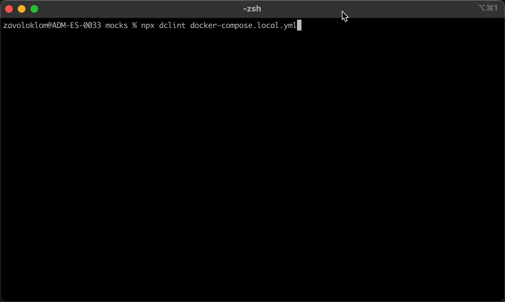

<!-- markdownlint-disable MD033 -->
<h1 align="center">
    
    <br>
    Docker Compose Linter
</h1>

<!-- markdownlint-disable MD013 -->
<p align="center">
    <a href="https://www.npmjs.com/package/dclint" target="_blank" rel="noopener noreferrer nofollow"></a>
    <a href="https://hub.docker.com/r/zavoloklom/dclint" target="_blank" rel="noopener noreferrer nofollow"></a>
    <a href="https://app.codacy.com/gh/zavoloklom/docker-compose-linter/dashboard?utm_source=gl&amp;utm_medium=referral&amp;utm_content=&amp;utm_campaign=Badge_grade" target="_blank" rel="noopener noreferrer nofollow"></a>
    
    <a href="https://conventionalcommits.org" target="_blank" rel="noopener noreferrer nofollow"></a>
</p>
<!-- markdownlint-enable MD013 -->

> **Note**: Docker Compose configurations vary greatly between different projects and setups. While DCLint is stable,
> there may be edge cases or unique setups that cause issues. If you encounter any problems or have suggestions,
> please feel free to [open an issue](https://github.com/zavoloklom/docker-compose-linter/issues)
> or [submit a pull request](#contributing). Your feedback is highly appreciated!

Docker Compose Linter (**DCLint**) is a utility designed to analyze, validate and fix Docker Compose files.
It helps identify errors, style violations, and potential issues in Docker Compose files, ensuring your configurations
are robust, maintainable, and free from common pitfalls.

## Features

- **Error Detection**: Identifies syntax errors and common issues in Docker Compose files.
- **Style Enforcement**: Enforces best practices and style guidelines for maintainable configurations.
- **Flexible Integration**: Can be used locally, in Docker, or integrated into CI/CD pipelines.
- **Configurable Rules**: Customize the linter's behavior and rules according to your project's needs.
- **Auto-fixable Rules**: Some rules include an auto-fix mode, allowing you to automatically format and correct certain
  issues in your files.
- **Comments Support**: After automated sorting and fixing, comments remain in the correct place, ensuring no important
  information is lost during the formatting process.

## Table of Contents

- [Usage with Node.js](#usage-with-nodejs)
- [Usage with Docker](#usage-with-docker)
- [Rules and Errors](#rules-and-errors)
- [Configuration](#configuration)
- [Integration with CI/CD Pipeline](#integration-with-cicd-pipeline)
- [Alternatives](#alternatives)
- [Demo](#demo)
- [Contributing](#contributing)
- [Changelog](#changelog)
- [License](#license)
- [Contacts and Support](#contacts-and-support)

## Usage with Node.js

You can install Docker Compose Linter globally or use it directly with npx.

> **Note:** DCLint requires Node.js version 18 or higher.

To install it globally:

```shell
npm install -g dclint
```

And then run by command:

```shell
dclint .
```

If you prefer not to install it globally, you can run the linter directly using npx:

```shell
npx dclint .
```

This command will lint your Docker Compose files in the current directory.

### Linting Specific Files

To lint a specific Docker Compose file or a directory containing such files, specify the path relative to your
project directory:

```shell
npx dclint /path/to/docker-compose.yml
```

### Display Help and Options

To display help and see all available options:

```shell
npx dclint -h
```

For more details about available options and formatters, please refer to the [CLI Reference](./docs/cli.md)
and [Formatters Reference](./docs/formatters.md).

## Usage with Docker

### Pull the Docker Image

First, pull the Docker image from the repository:

```shell
docker pull zavoloklom/dclint
```

### Run the Linter in Docker

To lint your Docker Compose files, use the following command. This command mounts your current working directory
`${PWD}` to the `/app` directory inside the container and runs the linter:

```shell
docker run -t --rm -v ${PWD}:/app zavoloklom/dclint .
```

### Linting Specific Files in Docker

If you want to lint a specific Docker Compose file or a directory containing such files, specify the path relative
to your project directory:

```shell
docker run -t --rm -v ${PWD}:/app zavoloklom/dclint /app/path/to/docker-compose.yml
```

### Display Help in Docker

To display help and see all available options:

```shell
docker run -t --rm -v ${PWD}:/app zavoloklom/dclint -h
```

For more information about available options and formatters, please refer to the [CLI Reference](./docs/cli.md)
and [Formatters Reference](./docs/formatters.md).

## Rules and Errors

Docker Compose Linter includes set of rules to ensure your Docker Compose files adhere to best practices. Detailed
documentation for each rule and the errors that can be detected by the linter is available here:

- [Rules Documentation](./docs/rules.md)
- [Errors Documentation](./docs/errors.md)

DCLint uses the [yaml](https://github.com/eemeli/yaml) library for linting and formatting Docker Compose files.
This ensures that any configuration files you check are compliant with YAML standards. Before any rule
checks are applied, two important validations are performed, which cannot be
disabled - [YAML Validity Check](./docs/errors/invalid-yaml.md)
and [Docker Compose Schema Validation](./docs/errors/invalid-schema.md).

## Configuration

DCLint allows you to customize the set of rules used during linting to fit your project's
specific needs. You can configure which rules are applied, their severity levels, and additional behavior settings
using a configuration file.

### Supported Configuration File Formats

DCLint supports flexible configuration options through the use
of [cosmiconfig](https://github.com/cosmiconfig/cosmiconfig). This means you can use various formats to configure the
linter, including JSON, YAML, and JavaScript files.

For example:

- `.dclintrc` (JSON, YAML, or JavaScript)
- `dclint.config.js` (JavaScript)
- A `dclint` key inside your `package.json`

### Example Configuration File

Here is an example of a configuration file using JSON format:

```json
{
  "rules": {
    "no-version-field": 0,
    "require-quotes-in-ports": 1,
    "services-alphabetical-order": 2
  },
  "quiet": false,
  "debug": true,
  "exclude": [
    "tests"
  ]
}
```

- **rules**: Customize which rules to apply and their severity levels (`0` - Disabled, `1` - Warning, `2` - Error).
- **quiet**: Suppresses non-error output if set to `true`.
- **debug**: Enables debug mode with additional output if set to `true`.
- **exclude**: Specifies files or directories to exclude from linting.

### Configure Rules

In addition to enabling or disabling rules, some rules may support custom parameters to tailor them to your specific
needs. For example, the [require-quotes-in-ports](./docs/rules/require-quotes-in-ports-rule.md) rule allows you to
configure
whether single or double quotes should be used around port numbers. You can configure it like this:

```json
{
  "rules": {
    "require-quotes-in-ports": [
      2,
      {
        "quoteType": "double"
      }
    ]
  }
}
```

In this example, the require-quotes-in-ports rule is enabled at the error level and configured to enforce double quotes
around ports.

## Integration with CI/CD Pipeline

Automate linting as part of your CI/CD pipeline by adding the Docker run command to your pipeline script. This ensures
that your Docker Compose files are always checked for errors before deployment.

### GitLab CI Example

```yaml
lint-docker-compose:
  image: docker:latest
  script:
    - docker run --rm -i -v ${CI_PROJECT_DIR}:/app zavoloklom/dclint . -f codeclimate -o gl-codequality.json
  artifacts:
    reports:
      codequality: gl-codequality.json
```

## Alternatives

Consider these alternative tools for Docker Compose linting and validation:

- [kics](https://github.com/Checkmarx/kics)
- [checkov](https://github.com/bridgecrewio/checkov)
- [yamllint](https://github.com/adrienverge/yamllint)
- [docker-compose-linter](https://github.com/alfonzso/docker-compose-linter/tree/master)

And this tools for Docker Compose formatting and fixing:

- [compose_format](https://github.com/funkwerk/compose_format/)
- [yamlfix](https://github.com/lyz-code/yamlfix)

## Demo

Here is a short demo of DCLint in action:



## Contributing

If you encounter any issues or have suggestions for improvements, feel free to open
an [issue](https://github.com/zavoloklom/docker-compose-linter/issues) or submit
a [pull request](https://github.com/zavoloklom/docker-compose-linter/pulls).

If you'd like to contribute to this project, please read through the [CONTRIBUTING.md](./CONTRIBUTING.md) file.

Please note that this project is released with a [Contributor Code of Conduct](./CODE_OF_CONDUCT.md). By participating
in this project, you agree to abide by its terms.

- [How to set up the project](./CONTRIBUTING.md)
- [How to add a new rule](./CONTRIBUTING.md#how-to-add-a-new-rule)

## Contributors

<!-- ALL-CONTRIBUTORS-LIST:START - Do not remove or modify this section -->
<!-- prettier-ignore-start -->
<!-- markdownlint-disable -->

<!-- markdownlint-restore -->
<!-- prettier-ignore-end -->

<!-- ALL-CONTRIBUTORS-LIST:END -->

## Changelog

The changelog is automatically generated based
on [semantic-release](https://github.com/semantic-release/semantic-release)
and [conventional commits](https://www.conventionalcommits.org/en/v1.0.0/).

See the [CHANGELOG.md](./CHANGELOG.md) file for detailed lists of changes for each version.

## License

This project is licensed under the MIT License. See the [LICENSE](./LICENSE) file for more information.

## Contacts and Support

If you find this repository helpful, kindly consider showing your appreciation by giving it a star ⭐

If you have any questions or suggestions, feel free to reach out:

- **Email**: [s.kupletsky@gmail.com](mailto:s.kupletsky@gmail.com)
- **Х/Twitter**: [zavoloklom](https://x.com/zavoloklom)
- **Instagram**: [zavoloklom](https://www.instagram.com/zavoloklom/)
- **GitHub**: [zavoloklom](https://github.com/zavoloklom)

Also, you can support this project with a donation:

[](https://www.paypal.com/donate/?hosted_button_id=ZKLT8EJ4KWA6L)
[](https://www.buymeacoffee.com/zavoloklom)
